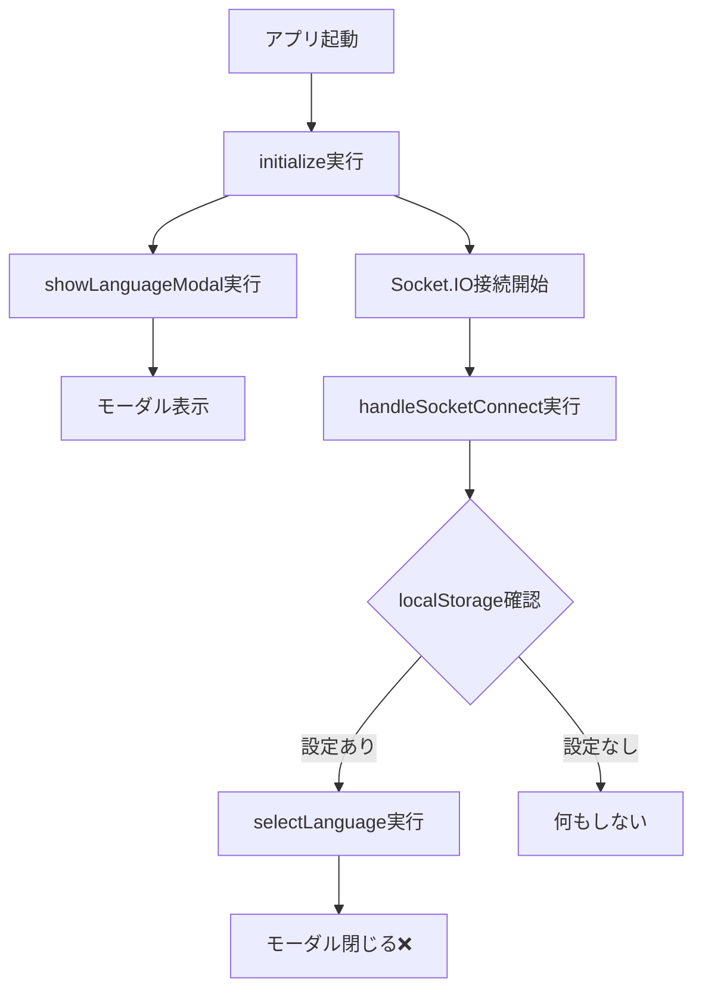

# 言語選択モーダルの不具合修正レポート

**作成日**: 2026年1月23日  
**対象ファイル**: `static/js/chat.js`  
**修正者**: AI Assistant  
**バージョン**: v1.1

---

## 📋 目次

1. [問題の概要](#問題の概要)
2. [発生していた現象](#発生していた現象)
3. [原因の調査](#原因の調査)
4. [根本原因の特定](#根本原因の特定)
5. [実施した修正内容](#実施した修正内容)
6. [修正後の動作仕様](#修正後の動作仕様)
7. [テスト方法](#テスト方法)
8. [技術的な補足](#技術的な補足)

---

## 問題の概要

### 不具合内容
アプリケーション起動時に言語選択モーダル（日本語/English）が一瞬表示されるが、ユーザーが選択する前に自動的に閉じてしまい、言語を選択できない。

### 期待される動作
- **初回訪問時**: 言語選択モーダルを表示し、ユーザーに日本語/Englishを選択させる
- **2回目以降**: 前回選択した言語を記憶し、自動的に適用する
- **設定変更時**: ⚙️ボタンからいつでも言語を変更できる

---

## 発生していた現象

### ユーザー視点
1. アプリを開く
2. 言語選択ウィンドウが一瞬表示される
3. 選択する間もなく、0.1秒程度で自動的に閉じる
4. 日本語が自動選択されている

### コンソールログ
```
✅ 言語選択モーダル表示完了
サーバーに接続しました
言語が設定/変更されました: ja  ← ここで勝手に閉じられる
🎮 Unity iframeを再表示しました
```

---

## 原因の調査

### 調査方法
1. ブラウザの開発者ツール（DevTools）でコンソールログを確認
2. `static/js/chat.js` のコードレビュー
3. 言語選択に関連する関数を追跡

### 発見した問題点

#### 問題点1: 初期化フローでの二重処理
```javascript
// 初期化関数（625-626行目）
function initialize() {
    // ...
    loadMuteState();
    showLanguageModal();      // ← ①モーダルを表示
    sendVisitorInfo();
    // ...
}
```

#### 問題点2: Socket接続時の自動言語選択
```javascript
// Socket接続ハンドラー（2614-2624行目）
function handleSocketConnect() {
    console.log('サーバーに接続しました');
    
    try {
        const savedLanguage = localStorage.getItem('preferred_language');
        if (savedLanguage && (savedLanguage === 'ja' || savedLanguage === 'en')) {
            selectLanguage(savedLanguage);  // ← ②モーダル表示直後に自動実行
        }
    } catch (e) {
        console.warn('保存済み言語設定の読み込みに失敗:', e);
    }
}
```

---

## 根本原因の特定

### タイミングの問題

```
時刻    処理内容                            結果
0ms     initialize() 開始                  
10ms    showLanguageModal() 実行           モーダル表示
15ms    Socket.IO接続完了                  
16ms    handleSocketConnect() 実行         
17ms    localStorage確認 → 'ja'発見        
18ms    selectLanguage('ja') 実行          モーダル閉じる ❌
```

### なぜこうなっていたか

1. **過去の訪問履歴**: ユーザーが一度でも言語を選択すると、`localStorage`に`preferred_language`が保存される
2. **二重の自動選択ロジック**: 
   - 初期化時: `showLanguageModal()` でモーダルを表示
   - Socket接続時: `handleSocketConnect()` で保存済み言語を自動適用
3. **競合**: ほぼ同時に実行されるため、モーダルが表示された直後に閉じられる

### コードの流れ図



---

## 実施した修正内容

### 修正1: `showLanguageModal()` 関数の改善（1161-1189行目）

#### 変更前
```javascript
function showLanguageModal() {
    if (!domElements.languageModal) {
        console.error('❌ 言語選択モーダルが見つかりません');
        selectLanguage('ja');
        return;
    }
    
    // Unity iframeを一時的に非表示
    if (domElements.unityFrame) {
        domElements.unityFrame.style.display = 'none';
        console.log('🎮 Unity iframeを一時的に非表示にしました');
    }
    
    domElements.languageModal.style.display = 'flex';
    console.log('✅ 言語選択モーダル表示完了');
}
```

#### 変更後
```javascript
function showLanguageModal(forceShow = false) {
    // 🆕 初回訪問かどうかをチェック
    if (!forceShow) {
        try {
            const savedLanguage = localStorage.getItem('preferred_language');
            if (savedLanguage && (savedLanguage === 'ja' || savedLanguage === 'en')) {
                console.log(`💾 保存済みの言語設定を使用: ${savedLanguage}`);
                selectLanguage(savedLanguage);
                return;  // モーダルを表示せず終了
            }
        } catch (e) {
            console.warn('言語設定の確認に失敗:', e);
        }
    }
    
    // 初回訪問 or 設定ボタンクリック時のみモーダルを表示
    if (!domElements.languageModal) {
        console.error('❌ 言語選択モーダルが見つかりません');
        selectLanguage('ja');
        return;
    }
    
    // Unity iframeを一時的に非表示
    if (domElements.unityFrame) {
        domElements.unityFrame.style.display = 'none';
        console.log('🎮 Unity iframeを一時的に非表示にしました');
    }
    
    domElements.languageModal.style.display = 'flex';
    console.log(forceShow ? 
        '✅ 言語選択モーダル表示完了（設定変更）' : 
        '✅ 言語選択モーダル表示完了（初回訪問）');
}
```

#### 変更のポイント
- **引数追加**: `forceShow = false` を追加し、強制表示モードを実装
- **初回判定**: localStorageをチェックし、保存済み言語がある場合はモーダルをスキップ
- **ログ改善**: 初回訪問か設定変更かを区別してログ出力

---

### 修正2: `handleSocketConnect()` の二重処理削除（2613-2633行目）

#### 変更前
```javascript
function handleSocketConnect() {
    console.log('サーバーに接続しました');
    updateConnectionStatus('connected');
    
    try {
        const savedLanguage = localStorage.getItem('preferred_language');
        if (savedLanguage && (savedLanguage === 'ja' || savedLanguage === 'en')) {
            selectLanguage(savedLanguage);  // 🐛 ここが問題
        }
    } catch (e) {
        console.warn('保存済み言語設定の読み込みに失敗:', e);
    }
    
    const visitorTimer = setTimeout(() => {
        sendVisitorInfo();
    }, 2000);
    
    if (conversationState.audioTimers) {
        conversationState.audioTimers.add(visitorTimer);
    }
}
```

#### 変更後
```javascript
function handleSocketConnect() {
    console.log('サーバーに接続しました');
    updateConnectionStatus('connected');
    
    // ✅ Socket接続時の自動言語選択は削除（初期化時に既に処理済み）
    // try {
    //     const savedLanguage = localStorage.getItem('preferred_language');
    //     if (savedLanguage && (savedLanguage === 'ja' || savedLanguage === 'en')) {
    //         selectLanguage(savedLanguage);
    //     }
    // } catch (e) {
    //     console.warn('保存済み言語設定の読み込みに失敗:', e);
    // }
    
    const visitorTimer = setTimeout(() => {
        sendVisitorInfo();
    }, 2000);
    
    if (conversationState.audioTimers) {
        conversationState.audioTimers.add(visitorTimer);
    }
}
```

#### 変更のポイント
- **二重処理削除**: Socket接続時の自動言語選択処理をコメントアウト
- **理由**: 初期化時の`showLanguageModal()`で既に処理されているため不要

---

### 修正3: 設定ボタンのイベントリスナー改善（772-774行目）

#### 変更前
```javascript
if (domElements.changeLanguageBtn) {
    domElements.changeLanguageBtn.addEventListener('click', showLanguageModal);
}
```

#### 変更後
```javascript
if (domElements.changeLanguageBtn) {
    domElements.changeLanguageBtn.addEventListener('click', () => showLanguageModal(true));
}
```

#### 変更のポイント
- **強制表示**: ⚙️ボタンクリック時は`forceShow=true`で呼び出し
- **効果**: 保存済み言語があっても必ずモーダルを表示

---

## 修正後の動作仕様

### ケース1: 初回訪問時（localStorageに設定なし）

```
ユーザー操作                システム動作
────────────────────      ────────────────────────────
アプリを開く              → initialize() 実行
                         → showLanguageModal() 実行
                         → localStorage確認 → 設定なし
                         → モーダル表示 ✅
                         
日本語を選択              → selectLanguage('ja') 実行
                         → localStorage保存: 'ja'
                         → UI更新（日本語表示）
                         → モーダル閉じる
```

**コンソールログ:**
```
✅ 言語選択モーダル表示完了（初回訪問）
言語が設定/変更されました: ja
🎮 Unity iframeを再表示しました
```

---

### ケース2: 2回目以降の訪問（localStorageに設定あり）

```
ユーザー操作                システム動作
────────────────────      ────────────────────────────
アプリを開く              → initialize() 実行
                         → showLanguageModal() 実行
                         → localStorage確認 → 'ja'発見
                         → selectLanguage('ja') 自動実行
                         → モーダル表示しない ✅
                         → UI更新（日本語表示）
```

**コンソールログ:**
```
💾 保存済みの言語設定を使用: ja
言語が設定/変更されました: ja
```

---

### ケース3: 設定ボタンから言語変更

```
ユーザー操作                システム動作
────────────────────      ────────────────────────────
⚙️ボタンをクリック        → showLanguageModal(true) 実行
                         → forceShow=true のため
                         → localStorage確認をスキップ
                         → モーダル表示 ✅
                         
Englishを選択             → selectLanguage('en') 実行
                         → localStorage上書き: 'en'
                         → UI更新（英語表示）
                         → モーダル閉じる
```

**コンソールログ:**
```
✅ 言語選択モーダル表示完了（設定変更）
言語が設定/変更されました: en
🎮 Unity iframeを再表示しました
```

---

## テスト方法

### テスト1: 初回訪問の確認

**目的**: localStorageをクリアして初回訪問状態を再現

**手順:**
1. ブラウザの開発者ツール（F12）を開く
2. Consoleタブで以下を実行:
   ```javascript
   localStorage.removeItem('preferred_language');
   location.reload();
   ```
3. ページがリロードされる

**期待結果:**
- ✅ 言語選択モーダルが表示される
- ✅ 日本語 or English を選択できる
- ✅ 選択するまでモーダルが閉じない
- ✅ 選択後にモーダルが閉じる

**確認コンソールログ:**
```
✅ 言語選択モーダル表示完了（初回訪問）
```

---

### テスト2: 2回目以降の訪問の確認

**目的**: 保存された言語設定が自動適用されることを確認

**手順:**
1. テスト1を実行し、言語を選択（例: 日本語）
2. ブラウザをリロード（F5 または Ctrl+R）

**期待結果:**
- ✅ モーダルは表示されない
- ✅ 前回選択した言語が自動適用される
- ✅ UIが即座に日本語表示される

**確認コンソールログ:**
```
💾 保存済みの言語設定を使用: ja
```

---

### テスト3: 設定ボタンからの変更確認

**目的**: いつでも言語を変更できることを確認

**手順:**
1. アプリ画面右上の⚙️ボタンをクリック
2. 言語選択モーダルが表示される
3. 現在と異なる言語を選択（例: English）

**期待結果:**
- ✅ ⚙️ボタンクリックでモーダルが表示される
- ✅ 言語を変更できる
- ✅ 変更後、UIが選択した言語に更新される

**確認コンソールログ:**
```
✅ 言語選択モーダル表示完了（設定変更）
言語が設定/変更されました: en
```

---

### テスト4: localStorageの確認

**目的**: 言語設定が正しく保存されていることを確認

**手順:**
1. 開発者ツール（F12）を開く
2. Applicationタブ → Local Storage → アプリのURL
3. `preferred_language` の値を確認

**期待結果:**
- ✅ 日本語選択時: `preferred_language: "ja"`
- ✅ English選択時: `preferred_language: "en"`

---

## 技術的な補足

### localStorageの仕組み

#### 基本情報
- **保存先**: ブラウザごとに永続的に保存（ドメイン単位）
- **容量**: 約5-10MB（ブラウザにより異なる）
- **有効期限**: なし（ユーザーが削除するまで永続）

#### 使用しているAPI
```javascript
// 保存
localStorage.setItem('preferred_language', 'ja');

// 取得
const lang = localStorage.getItem('preferred_language');

// 削除
localStorage.removeItem('preferred_language');

// 全削除
localStorage.clear();
```

---

### 言語切り替えの処理フロー

```javascript
// selectLanguage() 関数の主要処理
function selectLanguage(language) {
    // 1. アプリケーション状態を更新
    appState.currentLanguage = language;
    
    // 2. サーバーに通知
    if (socket && socket.connected) {
        socket.emit('set_language', { language: language });
    }
    
    // 3. UI表示を更新
    updateUILanguage(language);
    updateMuteButtonIcon();
    
    // 4. 関係性レベル表示を更新
    const conversationCount = visitorManager.visitData.totalConversations;
    const levelInfo = relationshipManager.calculateLevel(conversationCount);
    relationshipManager.updateUI(levelInfo, conversationCount);
    
    // 5. モーダルを閉じる
    if (domElements.languageModal) {
        domElements.languageModal.style.display = 'none';
    }
    
    // 6. Unity iframeを再表示
    if (domElements.unityFrame) {
        domElements.unityFrame.style.display = 'block';
    }
    
    // 7. AudioContextを初期化
    initializeAudioContextAfterUserGesture();
}
```

---

### モーダル表示/非表示の制御

#### CSS設定（style.css）
```css
.modal {
    display: none;                    /* デフォルトは非表示 */
    position: fixed;
    z-index: 3000;                    /* 最前面に表示 */
    left: 0;
    top: 0;
    width: 100%;
    height: 100%;
    background-color: rgba(0, 0, 0, 0.5);
    backdrop-filter: blur(5px);
}
```

#### JavaScript制御
```javascript
// 表示
domElements.languageModal.style.display = 'flex';

// 非表示
domElements.languageModal.style.display = 'none';
```

---

### Unity iframeの制御理由

モーダル表示時にUnity iframeを一時的に非表示にする理由:

```javascript
// Unity iframeを一時的に非表示
if (domElements.unityFrame) {
    domElements.unityFrame.style.display = 'none';
}
```

**理由:**
1. **クリックイベントの競合防止**: Unity WebGLがマウスイベントをキャプチャしてしまう
2. **z-indexの問題回避**: iframeは通常のHTML要素より優先度が高い
3. **パフォーマンス**: モーダル表示中はUnityレンダリングを停止

**再表示:**
```javascript
// 言語選択後、Unity iframeを再表示
if (domElements.unityFrame) {
    domElements.unityFrame.style.display = 'block';
}
```

---

### デバッグ用コマンド

#### 開発者ツールConsoleで使用可能

```javascript
// 現在の言語設定を確認
localStorage.getItem('preferred_language');

// 言語設定を削除（初回訪問状態に戻す）
localStorage.removeItem('preferred_language');
location.reload();

// 強制的に日本語に設定
localStorage.setItem('preferred_language', 'ja');
location.reload();

// 強制的に英語に設定
localStorage.setItem('preferred_language', 'en');
location.reload();

// モーダルを強制表示（ページ読み込み後に実行）
showLanguageModal(true);

// 現在のアプリ状態を確認
console.log(appState.currentLanguage);
```

---

## 今後の改善提案

### 提案1: 言語設定のバックエンド連携
現在はフロントエンドのみで言語設定を管理しているが、ユーザーアカウントと紐付けることで:
- デバイス間での言語設定共有
- ブラウザキャッシュクリア時も設定維持

### 提案2: 言語切り替えアニメーション
モーダルの表示/非表示にフェードイン/フェードアウト効果を追加:
```css
.modal {
    opacity: 0;
    transition: opacity 0.3s ease;
}

.modal.show {
    opacity: 1;
}
```

### 提案3: ブラウザ言語の自動検出
初回訪問時、ブラウザの言語設定を自動検出:
```javascript
const browserLang = navigator.language || navigator.userLanguage;
if (browserLang.startsWith('ja')) {
    selectLanguage('ja');
} else {
    selectLanguage('en');
}
```

---

## 変更履歴

| 日付 | バージョン | 変更内容 | 担当者 |
|------|-----------|---------|--------|
| 2026-01-23 | v1.1 | 言語選択モーダルの自動閉鎖問題を修正 | AI Assistant |
| 2026-01-23 | v1.0 | 初版作成 | AI Assistant |

---

## 関連ファイル

- `static/js/chat.js` - メインロジック
- `templates/index.html` - モーダルHTML
- `static/css/style.css` - モーダルスタイル
- `application.py` - バックエンドサーバー（Socket.IO）

---

## 連絡先

**問題報告・質問:**  
Email: suguru.fukushima@congen-ai.com  
GitHub: https://github.com/IVipcy/CERA_Avator

---

**End of Document**
